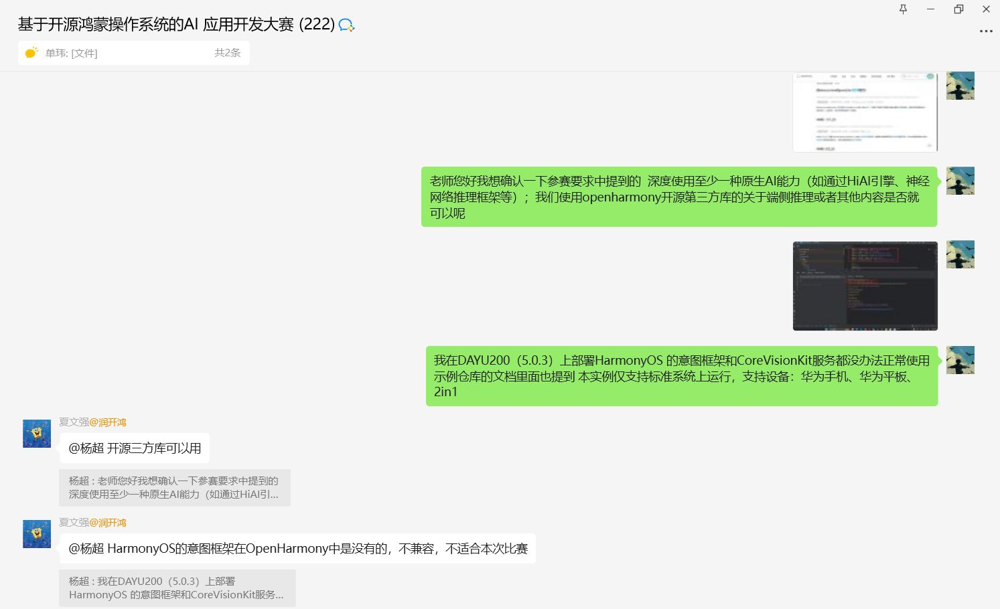

# 项目开发文档




## 2.项目评分细则

#### 2.1作品创意与原创性打分（30分）

系统+专家评审打分。
评估作品的创意新颖性、创新性和原创性。

#### 2.1.1创新性打分（10分）

系统+专家评审打分。
参赛作品是否具有创新性，应用OpenHarmony方案的创新点，与行业成熟方案相比较有差异化，有更好的产品表现。

#### 2.1.2实用性打分（10分）

系统+专家评审打分。
参赛作品是否具备一定的实用性，能否在应用场景中真实推广和应用，能够在社会生产实践中应用，有望取得较好的经济、社会效益。

#### 2.1.3原创性打分（10分）

系统+专家评审打分。
参赛作品的原创性，是否团队原创，参赛人员的技术自主性。

#### 2.2 功能与性能（30分）

系统+专家评审打分。
评估作品的功能性、稳定性和实用性，以及性能表现。

#### 2.2.1功能完整性打分 （10分）

系统打分。
参赛作品按照选题方向实现的功能完整性。

#### 2.2.2 稳定性打分（10分）

系统打分。
参赛作品运行和演示稳定可靠。

#### 2.2.3 特性应用打分(10分)

系统+专家评审打分。
参赛作为UI设计、人机交互和OpenHarmony特性应用(10分)

#### 2.3 技术难度（20分）

系统+专家评审打分。
参赛作品涉及系统服务层的AI算法和模型移植，以及在服务层使用Native封装应用层ArkTS的AI调用接口。

#### 2.3.1 文档和展示（10分）

专家评审打分。
评估作品提交的文档、展示和演示。

#### 2.3.2 开源生态建设（10分）

系统+专家评审打分。
项目在OpenHarmony的分支生态的潜在贡献。

综合评定：初赛成绩由评审专家在线上综合作出，并记录在案。决赛最终团队成绩，将在总决赛中的作品答辩环节的综合评分后得出。

1. **深度使用 AI (20分 技术难度)**:
   - **现状**: 你们已经跑通了 MindSpore Lite YOLOv5，这很好。
   - **加分项**: 必须实现**Native C++ 层封装**。现在的 `detect()` 是写在 ArkTS 里的吗？如果能把预处理、推理、后处理全部下沉到 C++ 层（NAPI），然后在 ArkTS 层只暴露一个 `analyzeFrame(buffer)` 接口，这就完美符合“Native封装”的要求。
   - **扩展 AI**: 除了 YOLO，加上 **Face ID (人脸识别登录)**。这属于“人类识别登录”，且可以使用现成的 Facenet 模型，正好体现多模型支持能力。
2. **视频回传与控制 (30分 功能与性能)**:
   - 这也是你们目前缺失的一环。
   - **方案**: 机器人端（树莓派/ROS）推流 (RTSP/MJPEG)，DAYU200 端拉流显示。
   - **创新点**: 在 DAYU200 上对拉回来的视频流**实时做 YOLO 检测**，如果发现“目标”（如漏水点、特定鱼类），自动触发截图保存或蓝牙发送停止指令。这叫“端侧闭环控制”。
3. **OpenHarmony 特性应用 (10分)**:
   - **分布式能力**: 如果你有两台 DAYU200 或者一台手机 + 一台板子，做一个“分布式显示”，板子做主控，手机做副屏显示视频流，这绝对是 OpenHarmony 的杀手锏。
   - **一次开发多端部署**: UI 适配平板和手机模式。

------

### 二、 具体的实施路线图 (Next Step)

你们现在卡在：*“YOLO跑通了单图，但没视频流，没蓝牙发送，没C++封装，不知道怎么串起来”*。

#### 第一步：完善控制功能 (蓝牙/网络发送)

- **目标**: 能用 DAYU200 控制小车动起来。
  - **网络 (HTTP/Socket)**: 如果走 WiFi，直接用 `http.createHttp()` 发送 GET/POST 请求给 ROS 小车的 API（例如 `http://192.168.1.100:5000/move?dir=forward`）。这比蓝牙更简单，适合传视频流的同时传指令。

#### 第二步：搞定视频流回传 (核心痛点)

- **目标**: 在 DAYU200 上看到小车的摄像头画面。

- 机器人端 (ROS/树莓派)

  - 最简单方案：运行 `mjpg-streamer`。它会把摄像头变成一个 HTTP URL，例如 `http://192.168.1.x:8080/?action=stream`。

- DAYU200 

  - 方案 A (简单)

    组件直接加载这个 URL。

    ```
    Web({ src: 'http://192.168.1.x:8080/?action=stream', controller: this.webController })
    ```

    缺点

    : 很难截取帧给 AI 做检测。

  - 方案 B (高分推荐)

    Socket 手动拉流

    - 如果不折腾 FFmpeg，建议写一个 Socket 客户端，去连小车的端口，接收 MJPEG 数据流。
    - MJPEG 就是一张张拼起来的 JPEG 图片。你只需要按字节流找到 `FF D8` (头) 和 `FF D9` (尾)，截取中间一段，这就是一张图。
    - **关键点**: 把截取到的 `ArrayBuffer` 直接喂给你的 `detectImageBuffer` 方法！这就是**实时视频检测**！

#### 第三步：Native C++ 封装 (拿分关键)

- **目标**: 把现在的 `AiController.ts` 里的逻辑（预处理、推理、NMS）搬到 C++ 层。
- **为什么要做**: 评分标准明确提到了“Native封装”。ArkTS 做密集计算（比如 `for` 循环处理 640x640 的像素）效率低，C++ 快得多。
- 做法
  1. 在 DevEco Studio 创建 Native C++ 工程。
  2. 引入 `MindSpore Lite C++ API` (不是 ArkTS API)。
  3. 写一个 `napi_init.cpp`，暴露一个 `Detect(buffer)` 接口给 JS。
  4. 在 C++ 里写 OpenCV (或者是纯指针操作) 做 Resize 和 Normalization。
  5. 在 C++ 里调 MSLite 推理。
  6. ArkTS 层调用：`let boxes = nativeModule.detect(imageBuffer);`

#### 第四步：人脸识别登录 (功能完整性)

- **目标**: APP 启动时，必须刷脸才能进入控制台。
- 实现
  1. 找一个轻量级的人脸模型 (如 FaceNet 或 MobileFaceNet) 转成 `.ms`。
  2. 流程：开启前置摄像头 -> 抓图 -> 识别人脸 -> 对比特征值 -> 成功则跳转主页。
  3. 这能体现“AI 能力的多样性”。

------

### 三、 针对你们现有代码的修改建议

你们已经有了蓝牙扫描和 YOLO 基础。下一步请立刻做这件事：

**实现一个“定时器循环检测”来模拟视频流推理**

假设你们暂时还没搞定 ROS 回传，先用手机相册里的视频，或者循环播放几张图片来模拟视频流，先把**“连续推理”**的性能跑通。

**修改 `MindSpore.ets`，增加“自动连续检测”模式：**

```
// 模拟视频流检测
async startMockVideoStream() {
  this.isAnalyzing = true;
  let index = 0;
  // 假设 uris 是你从相册选的一组图，或者固定的几张 rawfile
  let resourceList = ['test_fish.jpg', 'turtle.jpg', 'diver.jpg']; 
  
  this.timer = setInterval(async () => {
    let imgName = resourceList[index % resourceList.length];
    
    // 1. 推理
    let results = await AiController.getInstance().detect(context, imgName);
    
    // 2. 自动发送控制指令 (闭环控制演示)
    if (results.some(obj => obj.label === 0)) { // 假设 0 是“人”
       console.info("检测到人，发送停止指令！");
       // BleRobotController.getInstance().write("STOP"); 
    }
    
    // 3. 更新 UI
    this.detectedObjects = results;
    this.resultImage = $rawfile(imgName);
    
    index++;
  }, 200); // 每 200ms 处理一帧，即 5FPS
}
```

### 四、 总结：如何通过“开源项目”来做

目前确实没有现成的“DAYU200 水下机器人 AI 项目”给你抄，因为这正是比赛的创新点所在。

**你要参考的开源项目应该是拆解的：**

1. **AI 部分**: 参考 OpenHarmony 官方的 **“AI 图像识别”** 样例（通常在 Gitee 的 OpenHarmony/applications_app_samples 仓库）。搜索 `NAPI` 关键字，学习怎么用 C++ 封装 AI。
2. **视频流部分**: 搜索 **“OpenHarmony MJPEG Viewer”** 或者 **“OpenHarmony Socket Image”**。只要能通过网络拿到一张图片的 ArrayBuffer，你们的项目就成了 90%。
3. **控制部分**: 你们的蓝牙已经通了，HTTP 控制参考 `http` 模块文档即可，非常简单。


## 错误总结：

根据您的日志（`napi assert failed` 和 `Request not supported`），核心问题在于 **数据发送格式** 和 **特征值写入类型** 不匹配。

之前的代码是将字符转成 Hex 字符串再转回 Byte，这个过程容易在 NAPI 层出问题。对于 ROS 小车这种直接接收 ASCII 字符（如 'A', 'E'）的设备，最稳妥的方式是**直接构造 Uint8Array 发送单字节**。


## 一、问题 1：写入失败 (code=2900099)，原因是特征值选错

日志里有一行：

text


```
>>> 锁定写入特征值: Service=0000FFE0-0000-1000-8000-00805F9B34FB, Char=0000FFE1-0000-1000-8000-00805F9B34FB
...
gattWriteType: WRITE
...
no expected characteristic handle:0 type:1
```

而你更早的日志里曾经是：

text


```
>>> 锁定写入特征值: Service=0000FFE0-0000-1000-8000-00805F9B34FB, Char=0000FFE2-0000-1000-8000-00805F9B34FB
gattWriteType: WRITE_NO_RESPONSE
bluetooth writeCharacteristicValue success
BleRobotController: 写入成功 cmd="E", data=[69]
```

也就是说：

- 你原来写的是 **FFE2**，模式是 `WRITE_NO_RESPONSE`，写成功；
- 现在你硬指定了 **FFE1**，而底层提示“no expected characteristic handle:0 type:1”，说明对这个特征做 WRITE，是不被 GATT 客户端接受的（很可能 FFE1 没有写权限，或者这个 handle 不匹配）。

根源在你 `discoverServices` 里这段逻辑：

TypeScript


```
// 1. 优先寻找包含 FFE0 的服务
for (let s of services) {
  if (s.serviceUuid.toUpperCase().includes("FFE0")) {
    for (let c of s.characteristics) {
      if (c.characteristicUuid.toUpperCase().includes("FFE1")) { // 这里强行选 FFE1
        targetService = s;
        targetChar = c;
        break;
      }
    }
  }
  if (targetChar) break;
}

// 2. 如果没找到 FFE1，再找任意具�� Write 属性的特征值
...
```

这段代码并没有检查 `c.properties.write`，所以你现在很可能选了**不能写的 FFE1 characteristic**，导致写操作失败。

### 正确做法

按你之前“能成功写出 E/Z”的那次日志来看，正确的特征应该是：

- service: `FFE0`
- characteristic: `FFE2`（有 write 或 writeNoResponse 权限）

所以我们应该：

1. 在 `discoverServices` 里优先查 `FFE0` + `FFE2`，并且确认 `properties.write` 或 `writeNoResponse` 为 true；
2. 如果找不到，再退回到“第一个可写特征”。